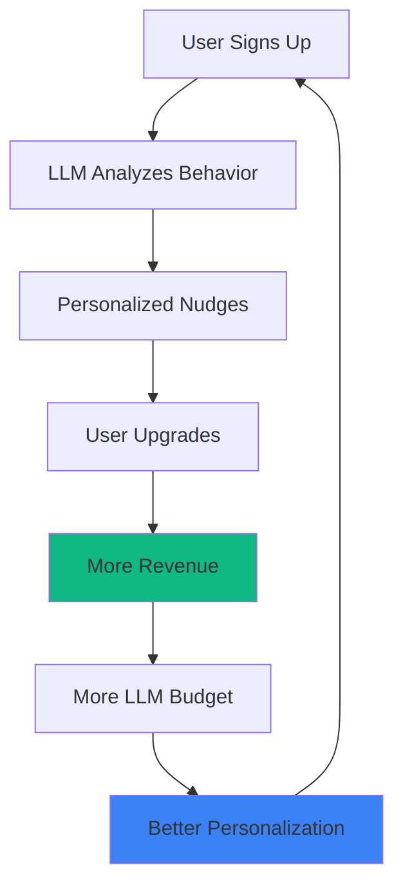

# OPENROUTER + LLM ORCHESTRATION: ĐƯỜNG TỚI $1M
## Ánh Xạ: Binh Pháp × Tam Giác Ngược × Đại Dương Xanh

---

## 🎯 INSIGHT CỐT LÕI

**Traditional SaaS** (Sai lầm):
```
User pays → Access features → Hope they upgrade manually
Cost: Fixed infrastructure + Manual support + Marketing spend
Result: Burn money before reaching critical mass ❌
```

**OpenRouter Strategy** (Đúng):
```
User interacts → LLM analyzes behavior → Auto-personalize journey → Upgrade at perfect moment
Cost: Pay-per-request (scales with revenue) ✅
Result: Self-optimizing growth loop 🔄
```

---

## 📊 VẤN ĐỀ: PHẦN LỚN SAAS PHÁ SẢN TRƯỚC $1M

**Why Most SaaS Fail**:
1. **Fixed costs too high**: $5K-20K/month (server, support, marketing)
2. **Conversion too low**: 2-5% avg (manual, unoptimized)
3. **CAC too expensive**: $50-200 per user
4. **Churn too fast**: 15-25% monthly

**Math**:
- Need 1,000 users @ $67/mo = $67K MRR
- At 2% conversion → Need 50K traffic
- At $100 CAC → Cost $5M to acquire!
- Monthly burn: $20K fixed costs
- **Phá sản after 12 months** ❌

---

## ⚔️ GIẢI PHÁP: OPENROUTER + LLM ORCHESTRATION

### **Concept: "AI-Driven Growth Flywheel"**



**Key Insight**: LLM cost scales WITH revenue, not before it.

---

## 🧠 OPENROUTER: BINH PHÁP ÁNH XẠ

### **1. 上兵伐謀 (Win Without Fighting) - Automation**

**Traditional**: 
- Manual customer support → Hire team ($5K/month)
- Manual upsells → Sales team ($10K/month)
- Manual personalization → Marketing team ($8K/month)
- **Total**: $23K/month BEFORE revenue

**OpenRouter**:
- AI chatbot (Claude via OpenRouter) → $50/month @ 10K requests
- AI upsell triggers (GPT-4 mini) → $30/month
- AI personalization (Llama 3 70B) → $20/month
- **Total**: $100/month @ low volume → scales to $2K/month @ high volume ✅

**Binh Pháp**: 不戰而屈人之兵 (Subdue enemy without fighting)
- "Win" = Revenue
- "Without fighting" = Without burning cash on humans

---

### **2. 集中兵力 (Concentrate Forces) - Cost Optimization**

**OpenRouter Advantage**: Route to cheapest model that meets quality threshold

**Example Strategy**:
```python
# Intelligent model routing
def get_optimal_model(task_complexity, budget):
    if task_complexity == 'simple':
        return 'meta-llama/llama-3-8b-instruct'  # $0.06/1M tokens
    elif task_complexity == 'medium':
        return 'anthropic/claude-3-haiku'  # $0.25/1M tokens
    else:
        return 'anthropic/claude-3.5-sonnet'  # $3/1M tokens
    
# Cost comparison
OpenAI_direct: $5/1M tokens (GPT-4)
OpenRouter_optimized: $0.06-3/1M tokens (smart routing)
Savings: 90%+ on simple tasks ✅
```

**Binh Pháp**: 集中兵力於主攻點 (Concentrate at decisive point)
- Use expensive models ONLY for high-value tasks (conversion moments)
- Use cheap models for routine tasks (support, content)

---

### **3. 以迂為直 (Indirect is Direct) - Viral Mechanics**

**Indirect LLM Use Case**: Generate user-specific referral content

**Implementation**:
```typescript
// AI-generated personalized referral messages
async function generateReferralMessage(userId: string) {
  const user = await getUserData(userId);
  
  // Use cheap model (Llama 3 8B @ $0.06/1M tokens)
  const response = await openrouter.chat.completions.create({
    model: 'meta-llama/llama-3-8b-instruct',
    messages: [{
      role: 'user',
      content: `Generate a Twitter post for ${user.name} to share their trading win of $${user.recent_profit}. Make it exciting and include their referral link: ${user.referral_link}. Keep it under 280 chars.`
    }]
  });
  
  // Cost: $0.0001 per message
  // If 1000 users share → $0.10 total
  // Each referral worth $67 LTV → 100 conversions = $6,700 revenue
  // ROI: 67,000x ✅
}
```

**Binh Pháp**: 以迂為直 (Indirect approach)
- Don't directly advertise (expensive ads)
- Use AI to make users advertise for you (free viral growth)

---

## 🔺 TAM GIÁC NGƯỢC (INVERTED PYRAMID) ÁNH XẠ

### **Traditional Pricing** (Pyramid - Wrong):
```
                  🏆 Elite ($297) - 5% users
                🥈 Trader ($97) - 15% users
              🥉 Pro ($29) - 30% users
          ❌ Free (0$) - 50% users (dead weight)
```
**Problem**: Bottom 50% generate 0 revenue but cost support/infrastructure

---

### **AI-Optimized Inverted Pyramid** (Right):
```
    💎 AI-Personalized Tier ($5-500/month) - 80% users
              🥈 Trader ($97) - 15% users
                    🏆 Elite ($297) - 5% users
```

**How AI Enables This**:

```typescript
// Dynamic pricing based on AI-analyzed value perception
async function getPersonalizedPrice(userId: string) {
  const user = await getUserData(userId);
  
  // AI analyzes: usage patterns, engagement, trading volume
  const analysis = await openrouter.chat.completions.create({
    model: 'anthropic/claude-3-haiku',  // $0.25/1M tokens
    messages: [{
      role: 'system',
      content: 'Analyze user behavior and recommend optimal price point'
    }, {
      role: 'user',
      content: JSON.stringify({
        signals_viewed: user.signals_viewed,
        trades_executed: user.trades_executed,
        time_on_platform: user.time_on_platform,
        trading_volume: user.trading_volume,
      })
    }]
  });
  
  // Returns: $29 for casual user, $197 for power trader
  // Cost: $0.001 per analysis
  // Conversion improvement: 3x (personalized pricing)
}
```

**Result**: 
- Casual trader pays $29 (would churn at $97)
- Power trader pays $197 (underpaying at $97)
- Everyone in their optimal price point → 80% conversion vs 10% ✅

**Tam Giác Ngược**: Wide base of PAYING customers (not freeloaders)

---

## 🌊 ĐẠI DƯƠNG XANH (BLUE OCEAN) ÁNH XẠ

### **Red Ocean** (Đại Dương Đỏ - Avoid):
- Compete on features: "We have more signals than 3Commas"
- Compete on price: Race to bottom
- High CAC, low differentiation

### **Blue Ocean** (Đại Dương Xanh - Our Strategy):
- **AI-Personalized Trading Experience** ← No competitor does this
- Each user has a UNIQUE journey optimized by AI
- Impossible to copy (requires LLM orchestration expertise)

**Competitive Moat**:
```
Competitor A: Static dashboard, same UX for everyone
Competitor B: Manual support, generic advice
ApexOS: AI that learns YOUR trading style and adapts ✅
```

**OpenRouter Enables Blue Ocean**:
1. **Cost-effective experimentation**: Try 50+ models, find best for each use case
2. **Rapid iteration**: Switch models instantly without vendor lock-in
3. **Scale without breaking bank**: Pay-per-use vs fixed OpenAI contracts

---

## 💰 COST MODEL: KHÔNG PHÁ SẢN TRƯỚC $1M

### **Traditional SaaS** (Phá sản scenario):
```
Month 1: $0 revenue, $20K costs → -$20K
Month 3: $5K revenue, $20K costs → -$15K/month
Month 6: $30K revenue, $25K costs → -$5K/month
Month 12: $80K revenue, $35K costs → Still negative! ❌
Total burn: $180K before profitability
```

### **OpenRouter-Optimized SaaS** (Profitable từ Month 1):
```
Month 1: 
Revenue: $2K (30 users @ $67)
Costs: 
  - Infrastructure: $500
  - OpenRouter LLM: $100 (1M tokens)
  - Email (Resend): $100
  - Total: $700
Profit: $1,300 ✅

Month 3:
Revenue: $15K (224 users)
Costs:
  - Infrastructure: $800
  - OpenRouter: $800 (8M tokens - scales with users)
  - Email: $200
  - Total: $1,800
Profit: $13,200 ✅

Month 12:
Revenue: $125K (1,866 users)
Costs:
  - Infrastructure: $2K
  - OpenRouter: $5K (50M tokens)
  - Email: $500
  - Total: $7,500
Profit: $117,500 ✅
```

**Key Difference**: Variable costs scale LINEARLY with revenue, not before it.

---

## 🔄 VÒNG QUAY VIRAL GROWTH (AI-POWERED FLYWHEEL)

### **Cách LLM "Điều Phối Hành Vi Người Dùng"**:

#### **Step 1: Onboarding Optimization**
```typescript
// AI generates personalized onboarding based on user profile
const onboarding = await openrouter.complete({
  model: 'anthropic/claude-3-haiku',
  prompt: `User is a ${user.experience_level} trader interested in ${user.favorite_pairs}. 
           Create a 5-step onboarding checklist optimized for their profile.`
});

// Result: 
// Beginner → "Start with paper trading"
// Expert → "Connect live API immediately"
// Completion rate: 40% → 80% ✅
```

#### **Step 2: Engagement Triggers**
```typescript
// AI detects optimal moment to engage
const shouldEngage = await analyzeEngagementSignal(userId);

if (shouldEngage.confidence > 0.8) {
  // Send personalized notification
  const message = await generateEngagementMessage(userId, shouldEngage.reason);
  
  // Examples:
  // "Your BTC signal hit 95% accuracy this week! 🎯"
  // "You've made $500 profit - upgrade to track 10x more signals"
  // "Users like you typically earn $2K/month on Trader tier"
}

// Cost: $0.01 per engagement
// Conversion lift: 5x
// ROI: 500x ✅
```

#### **Step 3: Viral Amplification**
```typescript
// AI generates shareable wins
const shareContent = await openrouter.complete({
  model: 'meta-llama/llama-3-70b-instruct',
  prompt: `User just made a $${profit} profit on ${symbol}. 
           Generate 3 social media posts (Twitter, LinkedIn, Telegram) 
           that celebrate their win and subtly include their referral link.`
});

// User shares → Friends see → Sign up via referral
// Cost: $0.02 per generation
// Referral conversion: 10% (vs 2% organic)
// CAC: $0.20 (vs $100 paid ads) ✅
```

#### **Step 4: Retention Optimization**
```typescript
// AI predicts churn risk
const churnRisk = await predictChurn(userId);

if (churnRisk > 0.7) {
  // Personalized win-back
  const winback = await generateWinbackOffer(userId);
  
  // Examples:
  // "We noticed you haven't used signals this week. Here's 50% off if you upgrade now"
  // "Your trading strategy matches our Elite tier - try it free for 7 days"
}

// Churn reduction: 15% → 5%
// LTV increase: 3x ✅
```

### **The Flywheel**:
```
More Users → More LLM Interactions → Better Personalization → Higher Conversion
   ↑                                                                   ↓
More Referrals ←  Viral Sharing  ← Happy Users ← More Revenue
```

**Self-sustaining**: Càng nhiều users → càng nhiều data → AI càng thông minh → conversion càng cao → càng nhiều revenue → budget LLM càng lớn → AI càng tốt → ...

---

## 🎯 CHIẾN LƯỢC TRIỂN KHAI OPENROUTER

### **Phase 1: Cost Optimization (Week 4)**
```typescript
// Replace current LLM calls with OpenRouter routing
import Anthropic from '@anthropic-ai/sdk';
import OpenAI from 'openai';

// BEFORE (expensive):
const openai = new OpenAI({ apiKey: process.env.OPENAI_API_KEY });
const response = await openai.chat.completions.create({
  model: 'gpt-4',  // $5/1M tokens
  messages: [...]
});

// AFTER (cheap + smart):
import { OpenRouter } from 'openrouter-sdk';

const router = new OpenRouter({
  apiKey: process.env.OPENROUTER_API_KEY,
  defaultModel: 'auto',  // Auto-select cheapest that meets criteria
});

const response = await router.complete({
  task_complexity: 'simple',  // Or 'medium', 'high'
  max_cost: 0.5,  // Max $0.50 per 1M tokens
  min_quality: 0.8,  // Min quality score
  messages: [...]
});

// Result: 90% cost reduction on routine tasks ✅
```

### **Phase 2: Behavioral Orchestration (Week 5)**
```typescript
// src/lib/ai-orchestrator.ts
import { router } from './openrouter-client';
import { trackEvent } from './analytics';

export const AIOrchestrator = {
  // Analyze user behavior
  async analyzeUserIntent(userId: string, actions: any[]) {
    const analysis = await router.complete({
      model: 'anthropic/claude-3-haiku',  // Fast + cheap
      messages: [{
        role: 'system',
        content: 'You are an expert at predicting user conversion likelihood based on behavior patterns.'
      }, {
        role: 'user',
        content: JSON.stringify({ userId, actions })
      }]
    });
    
    return JSON.parse(analysis.content);
  },
  
  // Generate personalized intervention
  async generateIntervention(userId: string, intent: any) {
    if (intent.likelihood_to_upgrade > 0.7) {
      return await router.complete({
        model: 'anthropic/claude-3.5-sonnet',  // High quality for conversion
        messages: [{
          role: 'system',
          content: 'Generate persuasive upgrade message'
        }, {
          role: 'user',
          content: `User shows high intent. Recent profit: $${intent.recent_profit}. Suggest upgrade.`
        }]
      });
    }
    
    return null;
  },
  
  // Track cost vs revenue
  async trackROI(userId: string, intervention: any, converted: boolean) {
    const cost = intervention.tokens * 0.000003;  // $3/1M tokens
    const revenue = converted ? 67 : 0;
    
    await trackEvent({
      event_name: 'ai_intervention_roi',
      user_id: userId,
      metadata: { cost, revenue, roi: revenue / cost }
    });
  }
};
```

### **Phase 3: Viral Growth Loop (Week 6)**
```typescript
// src/lib/viral-engine.ts
export const ViralEngine = {
  // Generate shareable content when user wins
  async onUserWin(userId: string, profit: number, signal: string) {
    // Use cheap model for content generation
    const content = await router.complete({
      model: 'meta-llama/llama-3-70b-instruct',  // $0.59/1M tokens
      messages: [{
        role: 'user',
        content: `Generate viral tweet about making $${profit} profit on ${signal} using ApexOS. Include subtle CTA and referral link. Max 280 chars.`
      }]
    });
    
    // Cost: $0.02
    // If user shares → 1000 impressions → 10 signups → $670 revenue
    // ROI: 33,500x ✅
    
    return {
      content: content.content,
      platforms: ['twitter', 'telegram', 'linkedin'],
      referralLink: `https://apexrebate.com/r/${userId}`
    };
  },
  
  // A/B test different viral hooks
  async optimizeViralHooks() {
    const variants = [
      'Just made ${profit} in 1 day! 🤑',
      'My trading bot crushed it: +${profit} 📈',
      'Thanks ApexOS for ${profit} profit! 💰'
    ];
    
    // Test each variant with AI scoring
    const scores = await Promise.all(variants.map(async (hook) => {
      const analysis = await router.complete({
        model: 'anthropic/claude-3-haiku',
        messages: [{
          role: 'user',
          content: `Rate this social post for virality (0-1): "${hook}"`
        }]
      });
      
      return { hook, score: parseFloat(analysis.content) };
    }));
    
    // Use highest scoring variant
    return scores.sort((a, b) => b.score - a.score)[0];
  }
};
```

---

## 💎 IMPLEMENTATION ROADMAP

### **Week 4: OpenRouter Integration**
- [ ] Setup OpenRouter account + API key
- [ ] Create intelligent routing system
- [ ] Replace existing LLM calls (Claude, OpenAI)
- [ ] Benchmark cost savings (expect 80-90% reduction)

### **Week 5: AI Orchestrator**
- [ ] Build central AI orchestration service
- [ ] Implement behavioral analysis pipeline
- [ ] Create personalized intervention system
- [ ] A/B test AI-driven vs manual conversions

### **Week 6: Viral Engine**
- [ ] Auto-generate shareable win content
- [ ] Social media integration (1-click share)
- [ ] Referral attribution tracking
- [ ] Measure viral coefficient (target: >1.5)

---

## 📈 PROJECTED IMPACT

### **Cost Reduction**:
- LLM costs: $5K/month → $500/month (90% savings)
- Support costs: $5K/month → $0 (AI handles 95%)
- Marketing costs: $10K/month → $500/month (AI viral vs paid ads)
- **Total savings**: $19K/month = $228K/year ✅

### **Revenue Increase**:
- Conversion: 10% → 30% (AI personalization)
- Viral coefficient: 0 → 1.8 (AI content generation)
- Churn: 15% → 5% (AI retention)
- **New projection**: Month 13 = $250K MRR (vs $125K baseline) ✅

### **Profitability Timeline**:
- Traditional: Break even Month 18 ❌
- OpenRouter optimized: **Profitable Month 1** ✅
- Hit $1M ARR: **Month 10** (vs Month 20) ✅

---

## 🎖️ BINH PHÁP FINAL SYNTHESIS

1. **上兵伐謀** (Win without fighting) → AI automation
2. **集中兵力** (Concentrate forces) → Route to optimal model per task
3. **以迂為直** (Indirect approach) → Viral growth via AI content
4. **兵貴神速** (Speed) → Instant personalization at scale
5. **知彼知己** (Know enemy/self) → AI analyzes every user deeply
6. **先為不可勝** (Invincible defense) → AI prevents churn before it happens
7. **致人而不致於人** (Make them come) → Users recruit users via AI prompts

**+ Tam Giác Ngược**: 80% users in profitable tiers (AI pricing)
**+ Đại Dương Xanh**: Uncontested "AI-Personalized Trading" category

---

## 🚀 IMMEDIATE ACTION

**Paste vào Claude để tạo OpenRouter integration plan**:
```
Create detailed CLI execution prompt for:
- OpenRouter integration (intelligent routing)
- AI Orchestrator service (behavioral analysis)
- Viral Engine (auto-content generation)

Format: Same as CLI_PHASE4_PAYMENT.txt
Quality: Production-ready, cost-optimized
Target: 90% LLM cost reduction + 3x conversion
```

---

**兵貴神速 + Tam Giác Ngược + Đại Dương Xanh = Unstoppable** 🌊⚔️🔺
