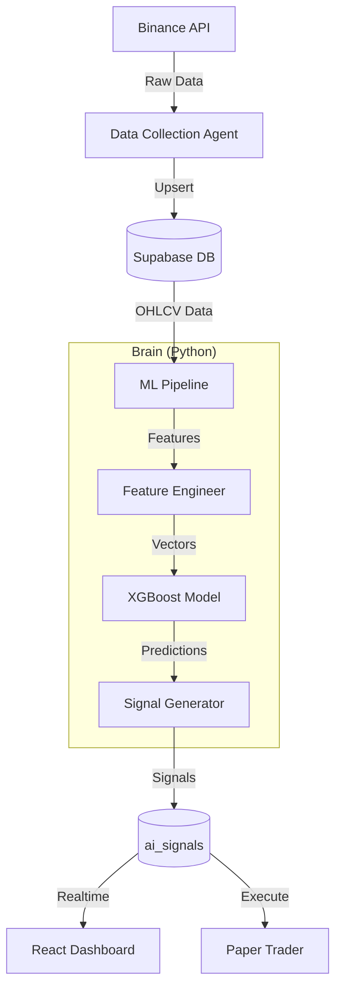

# AI Trading Architecture

## Overview
Apex OS uses a hybrid AI/Heuristic architecture to generate trading signals.

## System Design

## Components

1.  **Data Ingestion**: Python agent polling Binance.
2.  **Storage**: TimescaleDB-like schema in PostgreSQL.
3.  **Model**: XGBoost Classifier trained on technical indicators.
4.  **Execution**: TypeScript service converting probability -> signal.
5.  **Presentation**: Next.js frontend with real-time updates.

## Data Flow
1.  **Collection**: Agent fetches `1m` candles every minute.
2.  **Training**: Nightly re-training on expanded dataset.
3.  **Inference**: Every 5 minutes, the model predicts the next movement.
4.  **Signal**: If confidence > 70%, a Signal is created.
5.  **Action**: Users/Agents execute the trade.

## Security
- **API Keys**: Encrypted/Env-only.
- **Execution**: Paper trading by default.
- **Limits**: Max position size and daily signal caps.
