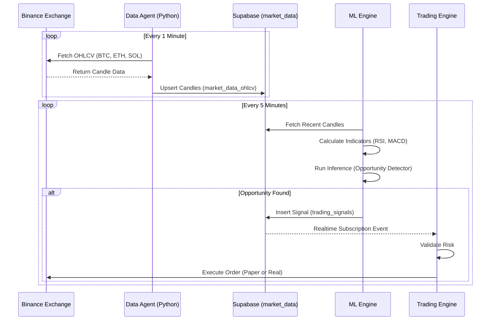

# Data Pipeline

```mermaid
sequenceDiagram
    participant EX as Binance Exchange
    participant DA as Data Agent (Python)
    participant DB as Supabase (market_data)
    participant ML as ML Engine
    participant TE as Trading Engine
    
    loop Every 1 Minute
        DA->>EX: Fetch OHLCV (BTC, ETH, SOL)
        EX-->>DA: Return Candle Data
        DA->>DB: Upsert Candles (market_data_ohlcv)
    end
    
    loop Every 5 Minutes
        ML->>DB: Fetch Recent Candles
        ML->>ML: Calculate Indicators (RSI, MACD)
        ML->>ML: Run Inference (Opportunity Detector)
        
        alt Opportunity Found
            ML->>DB: Insert Signal (trading_signals)
            DB-->>TE: Realtime Subscription Event
            TE->>TE: Validate Risk
            TE->>EX: Execute Order (Paper or Real)
        end
    end
```
